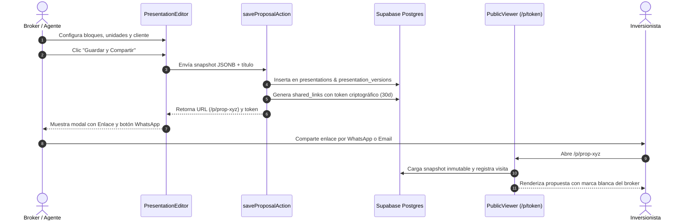

# Producto maestro — App OB Brokers

**Versión:** 1.3.0  
**Fecha de corte:** 15 de agosto de 2026  
**Propósito:** Definición de producto, visión operativa, arquitectura técnica, modelo de datos y roadmap para el ecosistema inmobiliario multiempresa líder, integrando un CRM de alta profundidad inspirado en GoHighLevel (GHL).

---

## 1. Visión y Propuesta de Valor

**App OB Brokers** es el sistema operativo integral diseñado para estructurar, operar y comercializar proyectos inmobiliarios de alta gama. Su valor diferencial radica en:
1. **Identidad Corporativa y Marca Blanca:** Cada broker y agencia opera con su propio logotipo, paleta cromática y datos de contacto persistidos en Supabase `brand_profiles`.
2. **CRM Comercial Estilo GoHighLevel:** Gestión omnicanal profunda mediante **Smart Lists** dinámicas, **Ficha 360 en 3 columnas**, feed cronológico de llamadas/WhatsApp/notas, preferencias DND y protección contractual de 60 días en `lead_reports`.
3. **Motor Documental de Alto Impacto:** Generación interactiva de dossiers y propuestas personalizadas con snapshots inmutables y visualizador público protegido (`/p/[token]`).
4. **Inventario Centralizado y Carga desde Excel:** Consulta de tipologías, disponibilidad y precios vigentes con importación manual estructurada.
5. **Evolución con IA (Gemini):** Hoja de ruta para un agente inteligente basado en Gemini capaz de analizar inventario, responder consultas en lenguaje natural y asistir en el seguimiento comercial.

---

## 2. Alcance Operativo Actual

### Módulos Activos en Producción:
* **Catálogo & Fichas de Proyecto:** Exploración de proyectos autorizados, galerías, planos y amenidades conectadas a PostgreSQL.
* **Smart Lists & Pipeline CRM:** Segmentación multicriterio, barra de acciones masivas, filtros por etapa/etiqueta y exportación CSV.
* **Editor Visual de Propuestas:** Guardado en tiempo real en `presentations` y `presentation_versions`, generación de `shared_links` con token seguro y botones de un clic para WhatsApp y copia de enlace.
* **Gestión de Marca Blanca:** Carga de logos oficiales a Supabase Storage y configuración cromática en vivo.
* **Autenticación SSR & Seguridad:** Refresco de cookies HttpOnly con `lib/supabase/middleware.ts` y guardianes en `proxy.ts`.

### Módulos Postergados / Fuera de Alcance Inmediato:
* **Facturación Electrónica y Pasarelas de Pago:** No aplica en esta fase.
* **Carga de Comprobantes de Depósito:** La separación de unidades se maneja mediante acuerdos manuales entre las partes.
* **Bloqueo Automático de Unidades:** El estado de inventario (Disponible / Bloqueado / Vendido) se actualiza de forma administrativa manual.

---

## 3. Arquitectura del Motor Documental

