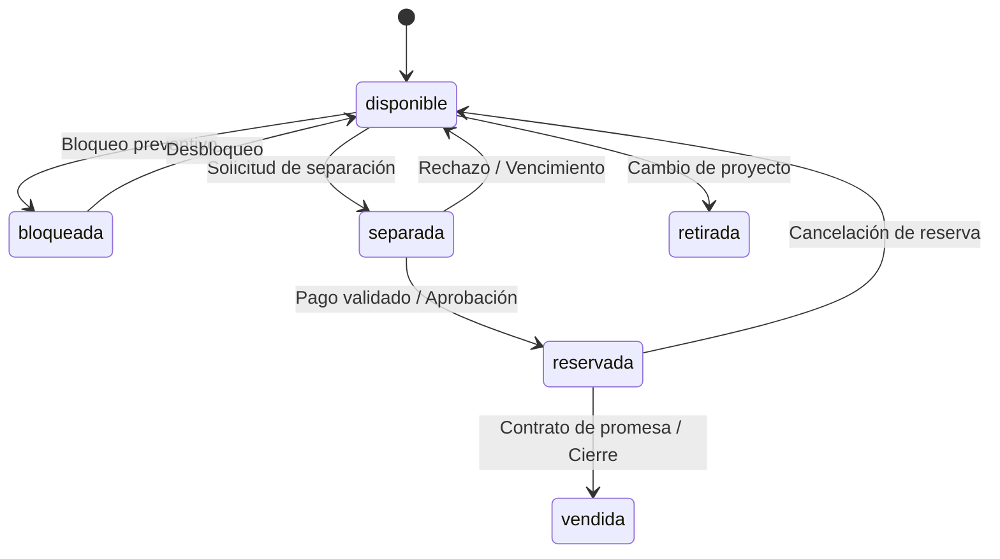

# Datos y flujos funcionales — App OB Brokers

**Estado de referencia:** 15 de agosto de 2026  
**Estructura:** 43 tablas en Supabase Postgres con integridad referencial, índices optimizados y RLS.

---

## 1. Entidades del Esquema de Datos

### 1.1. Identidad y Organizaciones
- `organizations`: Empresas tenant (platform, master_broker, agency, developer).
- `profiles`: Datos de usuario (nombre, teléfono, avatar, idioma).
- `memberships`: Vínculo usuario–organización con rol, estado y flag `is_primary`.
- `teams` y `team_members`: Agrupaciones internas dentro de agencias o master broker.
- `project_access`: Permisos de visualización/venta de proyectos por organización o usuario.

### 1.2. Catálogo Inmobiliario e Inventario
- `developers`: Datos fiscales y comerciales de las desarrolladoras.
- `projects`: Ficha principal del desarrollo (slug, ubicación, estado, comisión, tags).
- `project_media`: Fotografías y videos asociados alojados en Supabase Storage.
- `amenities` y `project_amenities`: Catálogo y asociación de amenidades destacadas.
- `typologies`: Modelos arquitectónicos (recámaras, baños, m², renders).
- `units`: Unidades individuales (código, tipología, nivel, orientación, precio actual, estado).
- `unit_price_history`: Historial inmutable de modificaciones de precio con usuario y motivo.
- `payment_plans` y `payment_milestones`: Estructuras de pago (reserva, inicial, cuotas, entrega).
- `project_documents` y `document_versions`: Archivos oficiales versionados en Storage privado.

### 1.3. CRM Avanzado de Contactos y Leads (Estilo GoHighLevel)
- `contacts`: Ficha central del cliente (nombre, apellido, email, teléfono, teléfono normalizado, últimos 4 dígitos, idioma, clasificación, origen, fecha de baja lógica).
- `custom_fields` y `contact_custom_field_values`: Campos personalizados tipados (texto, número, selector, fecha, booleano, url) configurables por organización.
- `smart_lists`: Filtros dinámicos guardados y ordenados por usuario u organización.
- `lead_reports`: Registro formal de reporte y protección comercial del cliente por proyecto con vigencia temporal (`protected_until`).
- `opportunities`: Negociaciones activas en el pipeline (etapa, prioridad, presupuestos, objetivo, seguimiento, motivo de cierre).
- `opportunity_projects` y `opportunity_units`: Relación multi-proyecto y multi-unidad por oportunidad.
- `activities`: Registro cronológico omnicanal (llamada, correo, WhatsApp, reunión, visita, tarea, sistema) con fecha límite y estado de completado.
- `notes`: Notas internas con formato enriquecido y autoría.
- `tags` y `contact_tags`: Etiquetas con código hexadecimal de color para categorización ágil.
- `consent_preferences`: Preferencias DND (Do Not Disturb) por canal (email, whatsapp, call, sms) con estado (`granted`, `denied`, `revoked`).

### 1.4. Motor Documental (Propuestas y Dossiers)
- `brand_profiles`: Identidad visual del broker/agencia (logos, colores hexadecimales, tipografía, datos de contacto).
- `presentation_templates`: Plantillas base de diseño (portadas, bloques de contenido, estilos).
- `presentations`: Encabezado de la propuesta o dossier asociado al contacto.
- `presentation_versions`: Snapshots inmutables en JSONB con precios, unidades y términos al momento del guardado/publicación.
- `shared_links`: Enlaces únicos de acceso web con expiración, protección opcional por PIN y revocación.
- `presentation_views` y `presentation_downloads`: Telemetría de interacción del cliente (aperturas, tiempo de lectura, descarga de PDF).

### 1.5. Transacciones y Mesa de Cierre
- `reservation_requests`: Solicitudes de separación iniciadas por brokers con comprobante de pago.
- `reservations`: Bloqueo formal de la unidad aprobado por el desarrollador/master broker.
- `sales`: Registro de cierre definitivo de la compraventa.
- `commission_rules` y `commission_settlements`: Reglas de distribución y liquidación de comisiones entre participantes.
- `audit_events`: Trazabilidad inmutable de operaciones sensibles (actor, entidad, acción, payload JSONB, IP).

---

## 2. Máquinas de Estado Normalizadas

### 2.1. Estado de Unidades (`units.status`)


### 2.2. Pipeline de Oportunidades (`opportunities.stage`)
1. **`new` (Nuevo):** Lead recién capturado sin interacción inicial.
2. **`contacted` (Contactado):** Primer contacto realizado (llamada, WhatsApp o correo).
3. **`qualified` (Calificado):** Presupuesto, plazo de compra y proyecto de interés confirmados.
4. **`proposal` (Propuesta enviada):** Dossier o propuesta personalizada compartida con el cliente.
5. **`negotiation` (En negociación):** Selección de unidad específica y discusión de plan de pagos.
6. **`reservation` (Reserva en proceso):** Solicitud de separación creada con comprobante.
7. **`won` (Ganado):** Cierre formal de la venta (requiere motivo de éxito).
8. **`lost` (Perdido):** Oportunidad descartada (requiere motivo obligatorio de pérdida).
9. **`paused` (Pausado / En espera):** Inversionista a la espera de próxima fase o liquidez futura.

---

## 3. Flujos Operativos Críticos

### 3.1. Flujo de Gestión de Contactos 360 y Smart Lists (Estilo GHL)

```
[Entrada de Lead] (Manual / Form / Import CSV)
       │
       ▼
[Deduplicación Automática] ─── (Coincidencia email / teléfono) ───► [Alerta de Duplicado / Merge]
       │ (Sin duplicado)
       ▼
[Creación Contact + LeadReport + Opportunity]
       │
       ▼
[Ficha 360 del Contacto]
 ├── Columna 1 (Atributos): Teléfonos, DND, Custom Fields, Tags, Scoring
 ├── Columna 2 (Timeline): Notas, WhatsApp, Llamadas, Envíos de Propuestas, Views
 └── Columna 3 (Pipeline): Oportunidades activas, Tareas con vencimiento, Unidades de interés
       │
       ▼
[Smart Lists]: Segmentación por filtros combinados (ej. "Inversionistas Punta Cana + Sin llamada > 3 días")
```

### 3.2. Flujo de Deduplicación y Fusión (Merge)
1. **Detección Preventiva:** Al escribir email o teléfono en el formulario de alta, el sistema ejecuta búsqueda indexada en `contacts` para la organización.
2. **Alerta Proactiva:** Si existe coincidencia exacta o por últimos 4 dígitos, se muestra banner informativo con el broker que tiene la protección vigente.
3. **Asistente de Fusión:** Un administrador de master broker puede seleccionar dos fichas duplicadas, elegir qué datos de contacto prevalecen y unificar automáticamente el historial de notas, actividades, propuestas y oportunidades bajo un único `contact_id`.

### 3.3. Flujo de Generación de Propuestas con Snapshot Inmutable
1. El broker ingresa al editor visual `/portal/proposals/new` y selecciona 1 o varios proyectos y unidades del catálogo.
2. El sistema carga los datos vivos de Supabase y aplica la marca del broker (`brand_profiles`).
3. El broker personaliza notas para el cliente, plan de pagos y condiciones especiales.
4. Al hacer clic en **"Generar propuesta"**, el sistema:
   - Crea un registro en `presentations`.
   - Genera una versión fija en `presentation_versions` con un snapshot JSONB de todas las unidades, precios y textos al segundo exacto.
   - Crea un `shared_links` con token criptográfico único.
5. Si el desarrollador cambia el precio de la unidad mañana, la propuesta enviada al cliente conserva intacto el precio acordado en su snapshot.

### 3.4. Flujo de Reserva y Bloqueo Atómico de Inventario
1. El broker solicita la reserva desde la ficha de la unidad o desde la oportunidad del cliente.
2. Se ejecuta una función transaccional de Postgres que verifica si el estado es estrictamente `disponible`.
3. Si está disponible, cambia el estado a `separada`, genera el `reservation_requests` e inicia un temporizador de protección (ej. 48-72 horas para validación de depósito).
4. El desarrollador o master broker valida el comprobante en Storage privado y aprueba la reserva (`reservations`), cambiando la unidad a `reservada`.
5. Si no se valida en el tiempo límite, un job o función expira la solicitud y regresa la unidad a `disponible` con auditoría.
