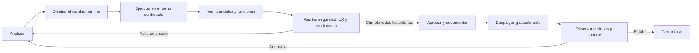
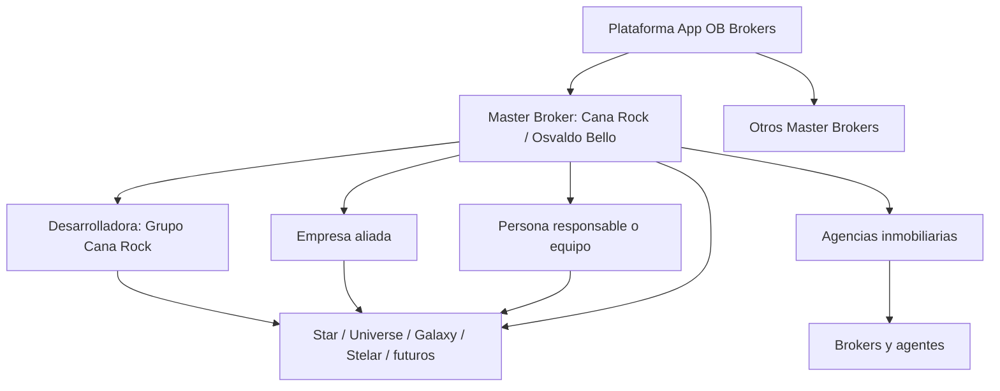
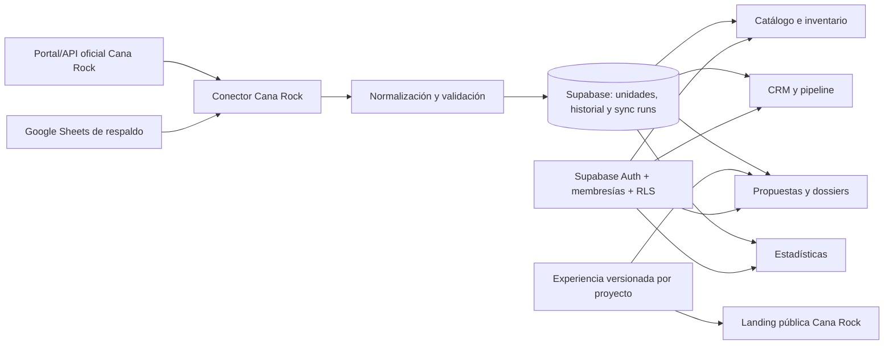

# Plan maestro de incorporación de Cana Rock a App OB Brokers

**Estado:** Ciclo 005 parcialmente completado; portafolio, activos, amenidades y disponibilidad pública filtrable operativos en local 
**Fecha de corte:** 4 de septiembre de 2026 
**Sistema destino:** App OB Brokers 
**Sistema origen:** `cana-rock.osvaldobello` 
**Responsable master broker inicial:** Osvaldo Bello

## 1. Objetivo

Incorporar la operación completa de Cana Rock dentro de App OB Brokers para que una sola plataforma pueda administrar master brokers, desarrolladores, aliados, proyectos, inventario, CRM, propuestas, dossiers, estadísticas y herramientas para brokers.

La incorporación será incremental, auditable y reversible. No será un reemplazo visual:

- La interfaz actual de App OB Brokers se conserva.
- La landing pública y la identidad visual actual de Cana Rock se conservan.
- Las propuestas y dossiers pueden usar diseños diferentes por proyecto.
- La identidad del desarrollador y del proyecto prevalece en cada pieza pública o comercial.
- Las funciones se migran por módulos, con pruebas de paridad antes de apagar cualquier función del sistema anterior.

## 2. Principios no negociables

1. **Sin migración masiva de una sola vez.** Cada capacidad entra por una fase independiente y reversible.
2. **Sin cambios visuales accidentales.** Toda superficie existente tendrá capturas de referencia y pruebas visuales en escritorio y móvil.
3. **Una fuente de verdad por dato.** El inventario de Cana Rock seguirá teniendo una fuente externa oficial; App OB Brokers almacenará una copia operacional, trazabilidad y estado de sincronización.
4. **Aislamiento multiempresa.** Una organización, aliado o broker nunca podrá consultar datos de otra organización sin una asignación explícita.
5. **Acceso por responsabilidad y proyecto.** El rol general no basta; también se valida la relación con el proyecto y la capacidad asignada.
6. **Snapshots comerciales inmutables.** Una propuesta o dossier publicado conserva precios, textos y unidades del momento en que fue generado.
7. **Toda migración tiene reconciliación.** Se comparan conteos, relaciones, archivos y valores críticos antes de aceptar un lote.
8. **No se copian secretos ni contraseñas como datos ordinarios.** Las credenciales se rotan y se almacenan fuera del código.
9. **Toda operación sensible deja auditoría.** Publicación, cambio de inventario, acceso, propuesta, reserva, permiso y exportación deben ser trazables.
10. **No se avanza por sensación.** Cada fase termina únicamente cuando cumple criterios de salida medibles.

## 3. Método permanente de trabajo

Cada módulo y cada fase pasan por el mismo ciclo. Si una auditoría falla, la fase vuelve a análisis con la evidencia encontrada.

### 3.1 Evidencia obligatoria por ciclo

Cada ciclo debe dejar:

- alcance y riesgo del cambio;
- mapa de datos o flujo afectado;
- archivos y migraciones modificados;
- pruebas automáticas y manuales ejecutadas;
- comparación antes/después;
- resultado de seguridad y RLS;
- capturas visuales cuando exista interfaz;
- métricas de rendimiento y errores;
- decisión: aprobado, repetir o bloquear;
- responsable y fecha.

### 3.2 Registro de ciclos

| Ciclo | Módulo | Hipótesis | Cambio ejecutado | Auditoría | Resultado | Evidencia | Próximo paso |
|---|---|---|---|---|---|---|---|
| 001 | Fundaciones | El núcleo destino puede absorber Cana Rock mediante conectores y capacidades | Inventario DB/activos, matriz funcional, matriz de acceso y utilidad read-only | Parcial: sin escrituras, sin datos personales y sin cambios visuales | Repetir antes de migrar | `docs/cana-rock/` | Backup/restauración, rotación y contrato de API |
| 002 | Portafolio | Supabase puede alojar organizaciones, proyectos e inventario público sin mezclar responsabilidades | Dos organizaciones, relación master broker/desarrollador, cuatro proyectos y 116 unidades | Proyectos/unidades/desarrollador reconciliados por API | Aprobado | Migraciones `20260903*` y `20260904*` | Activos, contenido y experiencia pública |
| 003 | Contenido y landing | Una ficha central puede alimentar CRM, landing, propuesta y dossier conservando la identidad Cana Rock | 43 archivos en Storage, 35 fotos de galería, 42 relaciones de amenidades, editor CRM y renderer Cana Rock | Compilación, API y cuatro landings verificadas localmente | Aprobado para publicar | `20260904025514_cana_rock_content_and_amenities.sql` | Tipologías, documentos y sincronización programada |
| 005 | Disponibilidad, visibilidades y galería | El inventario canónico y los módulos existentes pueden mostrarse completos sin exponer datos no públicos ni degradar la landing | Explorador reutilizable, filtros, estados, orden, carga progresiva, secciones controladas por constructor y visor de galería completo para los cuatro proyectos | 4/4 rutas HTTP 200, build, lint y detector de interfaz correctos; revisión visual en Stelar | Aprobado en local | `components/landing/CanaRockAvailabilityExplorer.tsx` y `CanaRockProjectLanding.tsx` | Recursos comerciales por proyecto; inventario en `docs/cana-rock/07_AUDITORIA_RECURSOS_COMERCIALES.md` |

## 4. Hallazgos del análisis inicial

### 4.1 App OB Brokers — sistema destino

La base destino ya contiene una fundación adecuada:

- Next.js 16, React 19 y Supabase Postgres.
- Organizaciones de tipo plataforma, master broker, agencia y desarrollador.
- Perfiles, membresías, equipos, ocho roles y estados de acceso.
- Acceso a proyectos por organización, equipo o membresía.
- RLS en tablas expuestas y autorización por organización.
- Catálogo, tipologías, unidades, precios, historial y documentos.
- CRM con contactos, reportes, oportunidades, actividades, notas, etiquetas y preferencias.
- Propuestas y dossiers con versiones, enlaces compartidos y eventos.
- Acuerdos, firmas, notificaciones, branding, estudio creativo y auditoría.

Debe fortalecerse para Cana Rock en cuatro áreas:

1. relaciones entre varios participantes de una alianza;
2. capacidades granulares por proyecto;
3. conectores externos con monitoreo y reconciliación;
4. variantes de landing, propuesta y dossier por proyecto.

### 4.2 Cana Rock — sistema origen

El repositorio y la página publicada muestran:

- Next.js 14, React 18 y MySQL.
- Landing con Star, Universe, Galaxy y Stelar.
- Páginas de proyecto, disponibilidad, fichas, brochures y contenidos multilingües.
- CRM con usuarios, leads, brokers, activos, tipologías, historial y administración.
- Propuestas con enlaces, revisiones, verificación, corrección y telemetría.
- Estadísticas geográficas y actividad de páginas/propuestas.
- Activos, campañas, correo, blog, contenido social, WhatsApp y Telegram.
- Tablas creadas o alteradas desde distintas rutas durante la ejecución.

### 4.3 Fuente real del inventario de Cana Rock

El flujo observado no es un formulario manual:

1. Consulta una API pública del portal de Cana Rock por proyecto.
2. Normaliza unidades, niveles, habitaciones, baños, áreas, precios, bloque, tipología y parqueos.
3. Aplica correcciones locales guardadas en MySQL.
4. Registra snapshots y cambios de disponibilidad.
5. Si falla el flujo principal, intenta hojas de Google Sheets configuradas por proyecto.
6. El cliente conserva temporalmente la última copia válida.

Este comportamiento debe migrarse como un **conector de inventario Cana Rock**, no como lógica fija dentro de una pantalla.

### 4.4 Riesgos encontrados

| Riesgo | Impacto | Tratamiento obligatorio |
|---|---|---|
| Una credencial de disponibilidad está incorporada en el código origen | Acceso no controlado y difícil rotación | Rotar, mover a secreto del servidor y auditar uso |
| Esquema MySQL creado o alterado desde rutas | Deriva y despliegues no repetibles | Convertir a migraciones versionadas |
| Roles de Cana Rock y App OB Brokers no coinciden | Acceso excesivo o pérdida de funciones | Mapear rol base más capacidades por proyecto |
| Datos entre API, Sheets, MySQL y código | Inconsistencia comercial | Definir precedencia, frescura y reconciliación |
| Autenticación propia y Supabase Auth | Identidades y sesiones duplicadas | Usar invitación, restablecimiento o importación oficialmente soportada |
| Diseño mezclado con datos fijos | Riesgo de alterar la identidad | Extraer renderizadores/plantillas por proyecto sin rediseño |
| Telemetría separada | Estadísticas incompletas | Normalizar eventos y su alcance |
| Copia directa sin mapa heredado | Duplicados y difícil reversión | Usar lotes y mapa de identificadores |

## 5. Modelo operativo objetivo

### 5.1 Jerarquía inicial propuesta

El master broker administra la relación comercial. El desarrollador conserva responsabilidad sobre producto e inventario. Los aliados participan solo en proyectos y capacidades asignadas.

La separación entre organizaciones fue aprobada el 3 de septiembre de 2026: **Cana Rock / Osvaldo Bello** será el master broker y **Grupo Cana Rock** será el desarrollador relacionado. Osvaldo Bello se registrará como miembro activo y responsable primario; su identidad personal no será una llave técnica de autorización.

### 5.2 Extensiones de datos candidatas

Se validarán antes de crear migraciones:

| Entidad candidata | Propósito |
|---|---|
| `organization_relationships` | Relacionar plataforma, master broker, desarrollador, aliado y agencia |
| `project_stakeholders` | Asignar organizaciones o miembros con función y responsabilidad |
| `project_capabilities` | Conceder capacidades específicas sin multiplicar roles globales |
| `project_experiences` | Elegir y versionar landing, propuesta y dossier |
| `integration_connections` | Registrar conector, alcance, estado y referencia segura de credenciales |
| `inventory_sync_runs` | Guardar resultado, conteos, errores y frescura de sincronizaciones |
| `external_unit_mappings` | Vincular el identificador externo estable con `units.id` |
| `inventory_source_snapshots` | Conservar evidencia recibida antes de normalizar |
| `migration_batches` y `legacy_id_map` | Hacer la migración repetible y reversible |

No se creará una tabla cuando una entidad existente cubra correctamente el caso.

## 6. Modelo de acceso

El acceso requiere simultáneamente:

1. membresía activa;
2. rol base válido;
3. asignación/capacidad válida para el proyecto.

| Perfil | Alcance esperado |
|---|---|
| Superadministrador | Todas las organizaciones, configuración técnica y auditoría global |
| Administrador master broker | Su organización, proyectos, CRM, equipo y estadísticas |
| Operaciones master broker | Contenido, inventario, documentos y soporte operativo |
| Responsable de alianza/proyecto | Solo proyectos y capacidades expresamente asignados |
| Administrador desarrollador | Proyectos propios, contenido, inventario y reservas |
| Desarrollador consulta | Lectura de inventario, métricas y operación propia |
| Administrador de agencia | Equipo y oportunidades de su agencia en proyectos autorizados |
| Broker/agente | Proyectos autorizados, clientes propios, propuestas y dossiers |
| Marketing/contenido | Activos y contenidos asignados, sin CRM sensible |
| Auditor | Lectura trazable limitada al alcance autorizado |

Capacidades candidatas: `project.view`, `project.content.manage`, `project.assets.manage`, `inventory.view`, `inventory.sync.monitor`, `inventory.overrides.manage`, `crm.contacts.view_own`, `crm.contacts.view_team`, `crm.pipeline.manage`, `proposal.create`, `proposal.review`, `dossier.template.manage`, `analytics.view_project`, `analytics.view_organization` y `members.manage`.

Todas se aplican en backend y RLS; ocultar una opción del menú no constituye seguridad.

## 7. Arquitectura objetivo

### 7.1 Reglas del conector

- Solo el servidor conoce credenciales.
- Cada proyecto define adaptador, identificador externo y frecuencia.
- El origen oficial prevalece sobre respaldos y correcciones, salvo regla aprobada y auditada.
- Se validan identificador, precio, moneda, estado, tipología y área.
- Una caída no convierte unidades en vendidas o no disponibles.
- Se muestra la última copia válida con fecha y frescura.
- Cada corrida registra recibidas, creadas, actualizadas, ignoradas, inválidas y ausentes.
- Cambios anómalos se ponen en cuarentena.
- La reejecución es idempotente.

### 7.2 Experiencias por proyecto

Cada proyecto seleccionará de forma versionada:

- renderer de landing;
- plantilla de propuesta;
- plantilla de dossier;
- marca, fuentes, colores y activos;
- módulos visibles;
- idiomas y textos legales;
- fuente y reglas de inventario.

La primera experiencia importada será Cana Rock y usará la interfaz publicada como referencia visual, sin rediseño.

## 8. Mapa preliminar de datos

| Cana Rock / MySQL | App OB Brokers / Supabase | Estrategia |
|---|---|---|
| `brokers` | `auth.users`, `profiles`, `memberships`, `organizations` | Deduplicar; invitar/restablecer; mapear rol y estado |
| `leads`, `client_reports` | `contacts`, `lead_reports`, `opportunities`, `activities` | Normalizar y conservar fuente, fecha y propietario |
| `proposal_links` | `presentations`, `presentation_versions`, `shared_links` | Snapshot por propuesta y referencia heredada |
| `proposal_review_history` | `audit_events` y, si hace falta, entidad de revisión | Preservar secuencia, actor, estado y comentario |
| logs de páginas/propuestas | `engagement_events` | Normalizar evento, proyecto, sesión y dispositivo |
| proyectos/configuración fija | `projects`, medios, marca y `project_experiences` | Extraer valores sin reescribir diseño |
| tipologías/unidades | `typologies`, `units`, `external_unit_mappings` | Resolver IDs estables |
| historial/overrides | historiales, snapshots y reglas de excepción | Separar origen oficial, excepción e historial |
| activos/documentos | Storage, `project_media`, `project_documents`, versiones | Hash, tamaño, MIME, visibilidad y versión |
| campañas/correo/blog/social | Módulos posteriores por organización/proyecto | Migrar después del núcleo |
| backups internos | Respaldo Supabase y exportaciones auditadas | No importar SQL generado desde rutas web |

## 9. Fases de ejecución

### Fase 0 — Seguridad y línea base

**Analizar:** rutas, tablas, archivos, integraciones, roles, capturas, conteos y propietarios. 
**Ejecutar:** backup cifrado/restaurable; inventario; staging; rotación de la credencial expuesta. 
**Auditar:** restauración, checksums, secretos y capturas escritorio/móvil. 
**Salida:** backup restaurable, inventario firmado, secretos rotados y responsables aprobados.

### Fase 1 — Organizaciones, alianzas, roles y RLS

**Analizar:** estructura legal/comercial, rol de Osvaldo, participantes, publicación, CRM y estadísticas. 
**Ejecutar:** relaciones/capacidades mínimas; organizaciones y accesos de prueba; autorización compartida. 
**Auditar:** pruebas positivas/negativas; aislamiento entre master brokers, agencias y proyectos; suspensión/vencimiento. 
**Salida:** cero acceso cruzado no autorizado y matriz aprobada.

### Fase 2 — Conector e inventario en sombra

**Analizar:** contrato de API, límites, estados, IDs y precedencia API/Sheets/overrides. 
**Ejecutar:** interfaz común, adaptador Cana Rock, corridas, snapshots y mapeos; lectura en sombra. 
**Auditar:** comparación unidad por unidad; timeout, credencial inválida, esquema nuevo, duplicados y desaparición masiva; latencia e idempotencia. 
**Salida:** periodo acordado de sincronización estable sin divergencias críticas.

### Fase 3 — Catálogo, activos y landing

**Analizar:** contenido, imágenes, logos, videos, documentos, tipologías e idiomas de los proyectos. 
**Ejecutar:** Storage versionado; proyectos/contenidos; renderer de la landing; dominio en staging. 
**Auditar:** comparación visual, enlaces, idiomas, SEO, accesibilidad y rendimiento; regresión de App OB Brokers. 
**Salida:** paridad pública funcional y visual aprobada.

#### Alcance obligatorio Cana Rock

- Star, Universe, Galaxy y Cosmos Stelar deben tener portada, logo y galería propios en Supabase Storage.
- Nombre visible obligatorio: **Cana Rock Cosmos Stelar**; `stelar` se conserva únicamente como compatibilidad de ruta/origen.
- Información general y amenidades se administran desde la ficha central del CRM.
- Landing, propuesta, dossier y estudio creativo consumen la misma ficha; no mantienen listas paralelas.
- Cada proyecto puede seleccionar una experiencia visual propia desde el constructor de landing.
- Cana Rock usa encabezado y experiencia `cana-rock-resort`; los demás proyectos conservan su experiencia actual.
- La aceptación exige conteo de archivos/relaciones, prueba de carga, revisión visual y compilación.
- Las tarjetas del portafolio deben mostrar proyecto y ubicación con claridad; no pueden tapar la portada, cortar datos ni competir con la llamada a la acción principal.
- En el catálogo de master brokers no se repiten etiquetas globales como “Master broker” o “En vivo”; cada tarjeta prioriza el proyecto, su precio, estado comercial y rangos reales de habitaciones, baños, metraje y parqueos.
- El catálogo usa tarjetas de mayor ancho en pantallas medianas, con un máximo de dos columnas hasta escritorio amplio, para evitar cortes en metrajes y demás datos.
- Habitaciones, baños, metraje y parqueos se presentan en bloques independientes, con nombre completo, valor visible y una familia SVG arquitectónica propia, sin recuadros de color detrás de los iconos.
- Las amenidades usan iconos semánticos según su tipo —no números genéricos— y heredan el azul primario y el dorado de cada experiencia de proyecto.
- La segunda métrica se adapta al ciclo del proyecto: **Entrega estimada** para construcción, **Estado · Entrega inmediata** para proyectos listos y **Estado · Proyecto entregado** para proyectos concluidos.

### Fase 4 — Usuarios y datos comerciales

**Analizar:** deduplicación y clasificación de datos; método seguro de acceso inicial. 
**Ejecutar:** lotes pequeños; organizaciones, perfiles, membresías, contactos, reportes y oportunidades; mapa heredado. 
**Auditar:** conteos, relaciones, duplicados y usuarios piloto. 
**Salida:** 100% de registros críticos reconciliados y excepciones documentadas.

### Fase 5 — Propuestas, revisiones y dossiers

**Analizar:** crear, compartir, verificar, corregir, aprobar y medir; partes comunes y específicas. 
**Ejecutar:** snapshots, enlaces, revisiones, eventos y plantillas versionadas por proyecto; compatibilidad heredada. 
**Auditar:** una/múltiples unidades, precios, planes, moneda, broker/cliente, PDF, expiración, PIN y telemetría. 
**Salida:** flujos prioritarios end-to-end con identidad por proyecto.

### Fase 6 — CRM unificado y menú por capacidad

**Analizar:** brecha función por función entre ambos CRM. 
**Ejecutar:** incorporar faltantes en el CRM actual sin rediseñar el shell; menú por rol, organización, proyecto y capacidad; funciones reutilizables. 
**Auditar:** menú y URL directa, CRUD, filtros, exportaciones, estados, dos proyectos y dos master brokers. 
**Salida:** funciones configurables, sin condicionales permanentes por nombre `Cana Rock`.

### Fase 7 — Estadísticas y observabilidad

**Analizar:** eventos, actores, alcance, consentimiento, privacidad y retención. 
**Ejecutar:** eventos normalizados; paneles por plataforma, master broker, desarrollador, agencia y broker; salud de conectores. 
**Auditar:** eventos enviados/guardados, deduplicación, fechas, filtros, exportación y alcance. 
**Salida:** métricas reconciliadas y confiables.

### Fase 8 — Piloto, paralelo y corte

**Analizar:** proyecto/equipo piloto, rollback, soporte y responsables. 
**Ejecutar:** operación paralela; comparación diaria; correcciones; cambio gradual de lectura y operación. 
**Auditar:** ingreso → proyecto → inventario → lead → propuesta/dossier → cliente → seguimiento → estadística. 
**Salida:** dos periodos consecutivos sin incidente crítico o umbral aprobado.

### Fase 9 — Retiro controlado

**Analizar:** rutas/datos todavía usados y retención legal. 
**Ejecutar:** modo lectura, redirecciones, exportación final y revocación de secretos. 
**Auditar:** restauración, enlaces, logs, dominios y dependencias. 
**Salida:** sistema anterior archivado, restaurable y sin dependencia operativa.

## 10. Estadísticas mínimas

### Inventario

- edad de la última sincronización;
- corridas correctas/fallidas;
- unidades recibidas, publicadas, inválidas y en cuarentena;
- cambios de precio/estado;
- divergencias y latencia del origen.

### Embudo comercial

- leads por fuente, proyecto, broker y agencia;
- tiempo hasta primer contacto;
- oportunidades por etapa;
- propuestas creadas, enviadas, abiertas y aceptadas;
- tasa de apertura y tiempo de lectura;
- solicitudes, reservas, ventas y pérdidas;
- conversión por proyecto, tipología, broker y periodo.

### Operación y calidad

- actividad por broker sin mezclar organizaciones;
- tareas pendientes/vencidas y usuarios activos;
- activos/documentos actualizados;
- salud de integraciones;
- errores de interfaz/servidor;
- rendimiento, discrepancias e intentos de acceso cruzado.

## 11. Puertas de calidad globales

### Datos

- conteos reconciliados, mapeos completos, sin huérfanos;
- importación idempotente, rollback probado y excepciones documentadas.

### Seguridad

- RLS en toda tabla expuesta;
- pruebas cruzadas por organización/proyecto;
- secretos solo en servidor y ningún `service_role` en cliente;
- operaciones sensibles auditadas y usuarios suspendidos sin acceso.

### Funciones

- caminos felices y fallos controlados;
- permisos también por URL/acción directa;
- enlaces/snapshots heredados resueltos;
- estados de carga, vacío y error;
- flujo comercial end-to-end.

### Visual

- capturas aprobadas en escritorio/móvil;
- identidad de cada proyecto preservada;
- shell actual de App OB Brokers sin cambios no solicitados;
- propuestas/dossiers comparados por plantilla;
- accesibilidad y teclado.

### Rendimiento y confiabilidad

- copia válida ante caída temporal del origen;
- frescura visible;
- recursos optimizados;
- errores/latencia observables;
- alertas accionables sin ruido.

## 12. Orden de migración

### Prioridad 1 — Núcleo

1. organizaciones, alianzas, responsabilidad y permisos;
2. conector y reconciliación de disponibilidad;
3. proyectos, tipologías, unidades y documentos;
4. usuarios, brokers, agencias y leads;
5. propuestas, dossiers, enlaces y revisiones;
6. estadísticas de inventario y embudo.

### Prioridad 2 — Operación ampliada

1. historial y overrides;
2. activos y contenidos;
3. campañas y correo;
4. contenido social y plantillas;
5. WhatsApp, Telegram y automatizaciones.

### Prioridad 3 — Optimización

1. alertas automáticas;
2. scoring y segmentación;
3. aprobaciones editoriales;
4. analítica entre master brokers;
5. herramientas creativas.

## 13. Decisiones pendientes antes de Fase 1

1. ~~¿`Cana Rock` representa al master broker, al desarrollador o serán dos organizaciones relacionadas?~~ **Resuelto:** serán dos organizaciones; Cana Rock / Osvaldo Bello como master broker y Grupo Cana Rock como desarrollador.
2. ¿Cuál es el nombre legal/comercial de la alianza y quién puede verla?
3. ¿Osvaldo Bello será administrador único, responsable primario o parte de un comité?
4. ¿Quién puede subir contenido y quién puede publicarlo?
5. ¿Quién es propietario de leads/propuestas: broker, agencia, master broker o alianza?
6. ¿Qué estadísticas ve cada participante?
7. ¿La API actual es el contrato oficial y quién rotará/entregará la credencial?
8. ¿Google Sheets seguirá como respaldo autorizado?
9. ¿Cuánto historial se migra y conserva?
10. ¿Qué dominios/enlaces heredados deben mantenerse indefinidamente?

Estas decisiones no bloquean el inventario de Fase 0, pero sí el esquema, RLS y la migración de usuarios.

## 14. Tablero de estado

| Fase | Estado | Último resultado | Próxima evidencia |
|---|---|---|---|
| 0. Seguridad y línea base | En progreso | 48 tablas, conteos exactos, activos y riesgos documentados | Backup restaurable, manifiesto SHA-256 y rotación |
| 1. Organizaciones y RLS | Implementación inicial aplicada | Dos organizaciones y relación `master_broker_for` creadas; estructuras de responsabilidades/capacidades activas | Completar participantes y pruebas autenticadas por rol |
| 2. Conector | Modo sombra preparado | Conector registrado en pausa y 116 unidades importadas/mapeadas desde la API pública | Rotar credencial, activar worker y reconciliación automática |
| 3. Catálogo y landing | Base completada; paridad en progreso | Cuatro proyectos con 43 activos propios, 116 unidades, amenidades editables, disponibilidad en tarjetas/lista, moneda explícita, galería con visor y navegación de portafolio verificadas en local | Recursos administrables y auditoría móvil |
| 4. Usuarios y CRM | No iniciada | Mapeo preliminar | Perfilado/deduplicación |
| 5. Propuestas y dossiers | No iniciada | Capacidades identificadas | Matriz de paridad |
| 6. CRM y menú | No iniciada | Brechas generales | Inventario función por función |
| 7. Estadísticas | No iniciada | Métricas mínimas | Diccionario de eventos |
| 8. Piloto y corte | No iniciada | — | Piloto y rollback |
| 9. Retiro anterior | No iniciada | — | Cero dependencia |

### Nota de paridad Stelar — ciclo 004

La auditoría de `/proyectos/cana-rock-stelar` determinó que la experiencia actual cubre identidad, concepto, galería, amenidades e inventario básico. Para lograr la paridad funcional del portal anterior faltan recursos comerciales administrables, línea blanca, disponibilidad filtrable, master plan/modelo, mapa, calculadora de pagos y traducciones. La colección de SVG de amenidades de Cana Rock se conserva únicamente dentro de esa experiencia; el catálogo multi-proyecto mantiene su iconografía propia.

La auditoría ampliada del portafolio confirma que Star, Universe, Galaxy y Cosmos Stelar están operativos en local. La prioridad de Fase 3 es compartida: completar recursos y disponibilidad una vez para los cuatro proyectos, en lugar de crear funciones aisladas por landing. Ver `docs/cana-rock/06_AUDITORIA_PORTAFOLIO_CANA_ROCK.md`.

## 15. Próximo ciclo recomendado

**Ciclo 001 — Fase 0: inventario verificable y decisiones de acceso**

1. Exportar solo metadatos y conteos de MySQL de Cana Rock.
2. Inventariar tablas, columnas, índices y relaciones reales.
3. Inventariar activos con tamaño, tipo, hash y proyecto.
4. Construir matriz Cana Rock → App OB Brokers: existente, parcial, ausente o reemplazable.
5. Resolver las diez decisiones pendientes con negocio.
6. Rotar la credencial incorporada en código antes de copiar el conector.
7. Preparar casos de aislamiento con dos master brokers ficticios.
8. Auditar y actualizar este documento antes de autorizar migraciones.

Hasta cerrar este ciclo no se debe copiar la base de datos ni conectar producción con producción.
