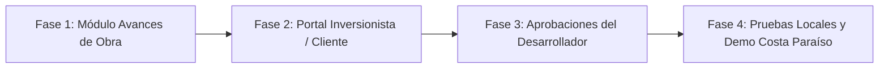

# Plan de Adecuación y Entrega: Propuesta Comercial Costa Paraíso

> **Objetivo:** Adecuar y robustecer la plataforma **App OB Brokers** para soportar de forma tangible, demostrable y profesional todos los compromisos adquiridos en la propuesta comercial ("Comercializador Exclusivo del Proyecto - Costa Paraíso"), **sin alterar ni comprometer las funcionalidades existentes**, probando cada módulo en local antes de cualquier despliegue a producción.

---

## 1. Estado Actual de Vulnerabilidades y Seguridad

- **Next.js:** Actualizado a `16.3.8` (elimina el RCE crítico en `next/og ImageResponse` - CVE-2026-94545).
- **brace-expansion:** Actualizado a `1.1.21` y `5.0.12` (resuelve los DoS por recursión descontrolada y expansión cuadrática).
- **Resultado del escaneo:** **0 vulnerabilidades encontradas**.

---

## 2. Matriz de Brechas (Propuesta vs. Plataforma)

| Compromiso en la Propuesta | Página | Estado Actual | Solución Requerida |
| :--- | :--- | :--- | :--- |
| **Portal del Cliente Inversionista ("Mis Unidades")** | Pág. 8 | ❌ No existe acceso directo del cliente final. Solo existe vista CRM interna del broker. | Crear portal del comprador accesible vía enlace seguro/código de reserva (`/mi-inversion/[code]` o `/portal/inversionista`). |
| **Documentos y Contratos del Cliente** | Pág. 8 | ⚠️ Parcial: Los brokers suben documentos en el CRM, pero el cliente no los consulta directamente en un espacio propio. | Vista protegida donde el cliente visualiza y descarga sus promesas de compraventa y recibos. |
| **Estado de Cuenta y Calendario de Pagos** | Pág. 8 | ⚠️ Parcial: Se registran pagos de reserva, pero falta desglose de cuotas (20% firma, 30% construcción, 50% entrega). | Módulo interactivo de estado de cuenta con montos pagados, saldo pendiente y fechas límites. |
| **Reportes y Avances de Obra (Fotos/Videos)** | Pág. 8, 14 | ❌ No existe sección estructurada de avances de obra con fotos, dron y avances porcentuales. | Módulo de "Avance de Obra" con galería mensual, videos y notas del desarrollador (visible para cliente y desarrollador). |
| **Aprobaciones en Línea para el Desarrollador** | Pág. 7, 15 | ⚠️ Parcial: El desarrollador ve reportes de ventas, pero no tiene bandeja de aprobación de ferias, piezas o presupuestos. | Pestaña de "Aprobaciones" en `/portal/developer` para aprobar o solicitar cambios de eventos y materiales. |
| **Brokers & Marca Blanca** | Pág. 8 | ✅ **Completo**: Acuerdos digitales, firma de contratos, inventario en vivo, comisiones y propuestas personalizadas. | Mantener intacto y operativo. |

---

## 3. Plan de Acción por Fases Graduales

### Fase 1: Módulo de Avances de Obra (Construcción & Bitácora)
* **Objetivo:** Permitir al equipo y al desarrollador registrar los avances físicos del proyecto Costa Paraíso.
* **Componentes:**
  1. Modelo de datos / migración Supabase para `project_construction_updates` (proyecto_id, fecha, hito, % avance general, fotos, enlace de video/dron, descripción).
  2. Formulario de carga en el panel administrativo (`/portal/admin/projects/[slug]`).
  3. Vista visual (Timeline / Galería interactiva) en la página del proyecto y lista para conectar al portal del cliente.
* **Criterio de Aceptación:** Registro y visualización fluida de fotos y porcentajes de avance sin afectar la carga de proyectos existentes.

---

### Fase 2: Portal del Cliente Inversionista (Comprador Final)
* **Objetivo:** Cumplir la promesa de *"Portal propio con su unidad, documentos y estado de cuenta"*.
* **Estrategia sin fricción:** Acceso rápido y seguro mediante enlace personalizado con código único de reserva (ej: `/mi-inversion/[codigo-reserva]`), además de credenciales si el usuario desea vincular su correo.
* **Secciones del Portal del Inversionista:**
  1. **Mi Unidad:** Resumen del lote/apartamento/villa adquirido en Costa Paraíso, metraje y características.
  2. **Estado de Cuenta:** Esquema de pagos según el plan acordado (Reserva US$3,000, 20% inicial, 30% cuotas de construcción, 50% contra entrega). Historial de pagos confirmados y saldos.
  3. **Mis Documentos:** Acceso seguro para consultar y descargar la promesa de compraventa firmada y recibos.
  4. **Avances de mi Proyecto:** Feed directo con las últimas fotos y reportes de obra subidos en la Fase 1.
  5. **Asistencia y Contacto:** Botón directo a WhatsApp y correo de su ejecutivo asignado.
* **Criterio de Aceptación:** El cliente ingresa con su código, ve exclusivamente su unidad y documentos, y puede descargar sus comprobantes.

---

### Fase 3: Módulo de Aprobaciones para el Desarrollador (`/portal/developer`)
* **Objetivo:** Permitir al desarrollador validar presupuestos de pauta, participación en ferias y piezas promocionales.
* **Componentes:**
  1. Registro de solicitudes de aprobación (Feria, Pauta Digital, Evento, Pieza gráfica) con estatus: `Pendiente`, `Aprobado`, `En revisión`.
  2. Vista en el panel del desarrollador con acciones directas para aprobar con un clic o dejar comentarios.
  3. Notificación interna del cambio de estado.
* **Criterio de Aceptación:** El desarrollador con rol `developer_admin` o `developer_viewer` puede ver y cambiar el estado de las solicitudes.

---

### Fase 4: Pruebas Locales Rigurosas y Preparación de Entorno Demo
* **Pruebas de no-regresión:**
  * Comprobar que los portales existentes (Broker, Agencia, Admin, CRM) sigan funcionando con normalidad.
  * Ejecutar `npm run build` y `npm run typecheck` en local.
* **Carga de Datos de Ejemplo (Costa Paraíso):**
  * Asegurar que Costa Paraíso cuente con datos realistas precargados (unidades de ejemplo, plan de pago 20/30/50, avance de obra con fotos de muestra) para que la demostración al desarrollador sea inmediata y contundente si la solicitan.

---

## 4. Próximo Paso Inmediato

Una vez validado este plan, comenzaremos con la **Fase 1 (Módulo de Avances de Obra)** asegurando compatibilidad con TypeScript y la base de datos local antes de tocar cualquier otra área.
